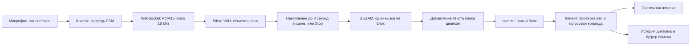

# Архитектура talk2g

Приложение состоит из клиента Python/PySide6 и сервера Python/WebSocket.
Сервер использует GigaAM v3 E2E и Silero VAD через ONNX Runtime на CPU.
Клиент вводит распознанные блоки в активное приложение после паузы.

## Путь диктовки

Захват и передача звука выполняются вне UI-потока. Очередь клиента ограничена
600 пакетами по 100 мс. Переполнение завершает запись с явной ошибкой.
По умолчанию аудио с микрофона не записывается на диск.

С настройкой `save_recordings` клиент запрашивает архив сессии в сообщении
`start`. Сервер пишет принятый PCM в `recordings/<date_uuid>/audio.wav` без
повторного захвата микрофона. `session.json` хранит параметры и итог, а
`events.jsonl` — события и диапазоны сэмплов каждой фактической гипотезы модели,
включая перекрытия, принудительные границы и обрезку подтверждённого начала.
WAV и метаданные закрываются до `session_end`, чтобы выгрузка собственного
сервера не оборвала сохранение. Ошибки диска не прерывают распознавание;
при отмене, разрыве или ошибке принятый звук сохраняется с отдельным статусом.
Переключение во время диктовки применяется к следующей сессии.

Клиент обрабатывает копию PCM локальным Silero VAD в потоке захвата, вне
PortAudio callback. `SpeechTimeout` отсчитывает 45 секунд от открытия микрофона
или последнего кадра речи; длительность задаётся настройкой `idle_timeout`.
Переключатель `stop_on_idle` в настройках и трее сохраняется сразу. Его отключение
убирает синюю часть полоски и отменяет автоматическую остановку; включение начинает полный
отсчёт в текущей записи. Если таймер и режим распознавания после паузы выключены,
клиент не загружает локальный VAD.
Три последовательных кадра речи подтверждают начало блока; изолированный щелчок
его не запускает. До полной паузы используется тот же пониженный порог VAD,
что и на сервере, чтобы более тихое продолжение речи сбрасывало отсчёт.
Используются времена захвата, поэтому загрузка модели и задержки
распознавания не сбрасывают таймер. Сигнал `idle_remaining` обновляет убывающую
синюю часть единой полоски в окне; истечение вызывает обычный Stop с обработкой хвоста.
`pause_remaining` обновляет жёлтую часть до распознавания блока. `SessionProgress`
рисует обе части на одной полоске без подписи; жёлтая истекает первой. При новой
речи обе части восстанавливаются. При отключённом таймере остаётся только жёлтая.
Микрофон открывается до подготовки локального VAD, и накопленная очередь
проверяется до решения об остановке.

Сервер принимает одну активную сессию. Один `ThreadPoolExecutor` выполняет
распознавание, пока асинхронный обработчик продолжает получать звук и команды.
Silero обрабатывает кадры по 512 сэмплов; сегментация сохраняет начало речи,
неполный кадр при Stop. В режиме блоков буфер ограничен 300 секундами накопленной
речи, в режиме окон — 60 секундами; продолжительность сессии — двумя часами.

## Подтверждение текста

По умолчанию `recognize_on_pause=true`, `recognition_pause=3`. Короткие паузы
остаются внутри блока. После полной паузы сегмент закрывается, тишина в конце
обрезается до 0,3 секунды, и сервер декодирует блок один раз. Во время речи
вызовов модели нет; `window` не разрезает длинную речь. `Transcript.commit_block`
добавляет результат целиком без сопоставления якорей, сохраняя реальные повторы.
Stop сразу закрывает текущий блок с полным хвостом; все готовые блоки обрабатываются
по очереди. Клиент проверяет подтверждение режима в ready. Переключение режима
в трее применяется к следующей сессии.

В режиме `recognize_on_pause=false` окно составляет 10 секунд, интервал распознавания — 0,7 секунды,
пауза завершения сегмента — 0,6 секунды, удержание свежего хвоста — 0,8 секунды.
Настройки и допустимые диапазоны определены в `config.py`.

`Transcript` сопоставляет текущую и предыдущую гипотезы по тексту и временам слов.
Устойчивое начало подтверждается, последнее слово и свежий хвост остаются в partial.
На паузе и Stop подтверждается остаток сегмента; принудительная граница окна
сохраняет хвост для распознавания с перекрытием. Временные якоря отделяют уже
введённые слова и сохраняют повторы, произнесённые в другое время.

Каждый commit содержит только новый текст и возрастающий `seq`.
Клиент игнорирует повторный номер и останавливает сессию при пропуске фрагмента.
Итог `session_end.text` должен совпадать с конкатенацией commit.
Подтверждённый текст дополняется; уже введённые символы не переписываются.
Контракт соединения — [PROTOCOL.md](PROTOCOL.md).

## Время жизни модели и ввод

С включённой загрузкой по требованию микрофон начинает запись сразу, а клиент
накапливает PCM до готовности сервера. Stop закрывает микрофон и обрабатывает
накопленный звук; после завершения собственный сервер приложения закрывается.
С выключенной загрузкой по требованию сервер запускается вместе с интерфейсом
и держит модель в памяти. `LocalService` управляет только процессом, который
запустил сам; отдельный или удалённый сервер продолжает работать независимо.

На Windows используются RegisterHotKey и Unicode SendInput. На X11 используются
GrabKey и вставка через clipboard; смена целевого окна приостанавливает ввод.
Wayland использует системные порталы, доступность которых зависит от рабочего стола.
Подтверждённая команда «конец связи» при включённой настройке завершает диктовку
и исключается из результата вместе с последующим текстом.

## Карта исходников

| Файл в `src/talk2g` | Ответственность |
|---|---|
| `cli.py` | Команды app, server, download, transcribe, replay, doctor, toggle и quit |
| `desktop.py` | Интерфейс, трей, настройки, виджет, управление записью и системной вставкой |
| `client.py` | Захват звука, очередь PCM, WebSocket и последовательность commit |
| `server.py` | Сессия распознавания, авторизация, обработка PCM и события |
| `audio.py` | Чтение аудиофайлов, PCM, сегментация и перекрытия |
| `model.py` | Веса GigaAM/Silero, ONNX Runtime, слова с временными отметками |
| `transcript.py` | Подтверждение текста, удержание хвоста и временные якоря |
| `input.py`, `hotkey.py`, `xkb.py`, `portal.py` | Платформенная вставка и глобальный хоткей |
| `service.py` | Проверка health и управление собственным сервером |
| `voice_command.py` | Обработка команды остановки |
| `config.py`, `history.py` | Настройки и SQLite-история последних 100 диктовок |
| `recording.py` | Серверный WAV, журнал входных окон и итог сессии |
| `autostart.py`, `runtime.py` | Автозапуск и подготовка окружения Qt |

Настройки, SQLite и логи находятся в `.data`, веса — в `models`,
сохранённые аудиосессии — в `recordings` на стороне сервера.
Корень задаётся `TALK2G_HOME`, аргументом `app --home` или расположением
проекта/автономного приложения. Локальные данные и веса не входят в Git.
Проверки — [VALIDATION.md](VALIDATION.md); сборка — `packaging/build.py`.
