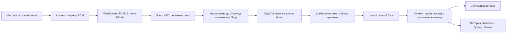

# Архитектура talk2g

Приложение состоит из клиента Python/PySide6 и сервера Python/WebSocket.
Сервер использует GigaAM v3 E2E и Silero VAD через ONNX Runtime на CPU.
Клиент вводит распознанные блоки в активное приложение после паузы.

## Путь диктовки

Захват и передача звука выполняются вне UI-потока. Очередь клиента ограничена
600 пакетами по 100 мс. Переполнение завершает запись с явной ошибкой.
По умолчанию аудио с микрофона не записывается на диск.

С настройкой `save_recordings` клиент запрашивает архив сессии в сообщении
`start`. Сервер пишет принятый PCM в `recordings/<date_uuid>/audio.wav` без
повторного захвата микрофона. `session.json` хранит параметры и итог, а
`events.jsonl` — события и диапазоны сэмплов каждого фактического вызова модели,
с учётом начала речи и обрезки тишины после паузы.
WAV и метаданные закрываются до `session_end`, чтобы выгрузка собственного
сервера не оборвала сохранение. Ошибки диска не прерывают распознавание;
при отмене, разрыве или ошибке принятый звук сохраняется с отдельным статусом.
Переключение во время диктовки применяется к следующей сессии.

Клиент обрабатывает копию PCM локальным Silero VAD в потоке захвата, вне
PortAudio callback. `SpeechTimeout` отсчитывает 45 секунд от открытия микрофона
или последнего кадра речи; длительность задаётся настройкой `idle_timeout`.
Переключатель `stop_on_idle` в настройках и трее сохраняется сразу. Его отключение
убирает синюю часть полоски и отменяет автоматическую остановку; включение начинает полный
отсчёт в текущей записи. Локальный VAD также управляет жёлтым отсчётом
до распознавания блока, поэтому работает и при отключённом автозавершении.
Три последовательных кадра речи подтверждают начало блока; изолированный щелчок
его не запускает. До полной паузы используется тот же пониженный порог VAD,
что и на сервере, чтобы более тихое продолжение речи сбрасывало отсчёт.
Используются времена захвата, поэтому загрузка модели и задержки
распознавания не сбрасывают таймер. Сигнал `idle_remaining` обновляет убывающую
синюю часть единой полоски в окне; истечение вызывает обычный Stop с обработкой хвоста.
`pause_remaining` обновляет жёлтую часть до распознавания блока. `SessionProgress`
рисует обе части на одной полоске без подписи; жёлтая истекает первой. При новой
речи обе части восстанавливаются. При отключённом таймере остаётся только жёлтая.
Микрофон открывается до подготовки локального VAD, и накопленная очередь
проверяется до решения об остановке.

Сервер принимает одну активную сессию. Один `ThreadPoolExecutor` выполняет
распознавание, пока асинхронный обработчик продолжает получать звук и команды.
Silero обрабатывает кадры по 512 сэмплов; сегментация сохраняет начало речи,
неполный кадр при Stop. Буфер ограничен 300 секундами накопленной
речи; продолжительность сессии — двумя часами.

## Подтверждение текста

`recognition_pause=3` по умолчанию. Короткие паузы
остаются внутри блока. После полной паузы сегмент закрывается, тишина в конце
обрезается до 0,3 секунды, и сервер декодирует блок один раз. Во время речи
вызовов модели нет. `Transcript.commit_block`
добавляет результат целиком без сопоставления якорей, сохраняя реальные повторы.
Stop сразу закрывает текущий блок с полным хвостом; все готовые блоки обрабатываются
по очереди. Клиент проверяет подтверждение поддержки в ready.
Настройки и допустимые диапазоны определены в `config.py`.

Каждый commit содержит только новый текст и возрастающий `seq`.
Клиент игнорирует повторный номер и останавливает сессию при пропуске фрагмента.
Итог `session_end.text` должен совпадать с конкатенацией commit.
Подтверждённый текст дополняется; уже введённые символы не переписываются.
Контракт соединения — [PROTOCOL.md](PROTOCOL.md).

## Время жизни модели и ввод

С включённой загрузкой по требованию микрофон начинает запись сразу, а клиент
накапливает PCM до готовности сервера. Stop закрывает микрофон и обрабатывает
накопленный звук; после завершения собственный сервер приложения закрывается.
С выключенной загрузкой по требованию сервер запускается вместе с интерфейсом
и держит модель в памяти. `LocalService` управляет только процессом, который
запустил сам; отдельный или удалённый сервер продолжает работать независимо.

На Windows используются RegisterHotKey и Unicode SendInput. На X11 используются
GrabKey и вставка через clipboard; смена целевого окна приостанавливает ввод.
X11 требует XKB detectable autorepeat; отсутствие расширения завершает
регистрацию хоткея с ошибкой. Невозможность проверить фокус также останавливает вставку.
Wayland использует RemoteDesktop, Clipboard и GlobalShortcuts; отказ любого
интерфейса завершает авторизацию с ошибкой, без другого способа вставки.
Подтверждённая команда «конец связи» при включённой настройке завершает диктовку
и исключается из результата вместе с последующим текстом.

## Границы модулей

`desktop.MainWindow` связывает пользовательские действия, захват, историю и ввод.
Вкладки в `ui/` отвечают за виджеты и испускают сигналы намерений пользователя;
форма настроек собирает новый `Settings`, а приложение проверяет, сохраняет
и применяет его. Зависимость идёт от контроллера к представлениям.

`protocol.py` формирует и проверяет handshake и выделяет настройки сессии,
не изменяя серверные значения по умолчанию. Клиент и CLI replay используют
его проверку ответов v1 до Qt-сигналов, печати текста и записи событий;
некорректный ответ завершает операцию с сохранением подтверждённого префикса.
Авторизация и допуск одной сессии
остаются на границе соединения в `server.py`.

Недостающие веса скачиваются через urllib с закреплённых ревизий GigaAM/Silero
одним HTTP-запросом на файл; Hugging Face SDK не входит в зависимости приложения.
Сетевого перехода к кэшу нет. HTTP redirects
выполняются как часть ответа сервера. Файл публикуется атомарно после полной
загрузки; сетевой отказ или неполный Content-Length завершают операцию.
Готовые файлы используются локально. ONNX получает существующий каталог
и CPUExecutionProvider. Встроенный ONNX fallback отключён при создании ASR,
resampler и VAD; предварительная обработка ASR выполняется NumPy.
Токены без временных отметок приводят к явной ошибке.

`RecognitionSession` принимает PCM, управляет сегментами и расписанием
распознавания. `SessionOutput` отправляет события и управляет необязательным
архивом; ошибки диска не становятся ошибками модели. Транспорт отвечает за
Stop/Cancel, разрыв соединения и отмену задач. Эта сессия не зависит от Qt
или конкретного WebSocket-соединения.

`DictatedText` проверяет commits через `Delivery`, фильтрует голосовую команду
и сверяет полный серверный результат с исходными фрагментами. Отдельный
пользовательский текст нужен потому, что команда исключается из диктовки,
но остаётся в ответе сервера. При несовпадении выдаётся ошибка; подтверждённый
текст сохраняется в UI и истории без подмены серверным итогом. `InsertionQueue` отвечает
только за упорядоченную вставку, фокус и ожидание отпускания модификаторов.

Клиент, серверные сессии и команда `transcribe` используют одинаковое
распознавание целых блоков. Пауза задаётся `recognition_pause` в настройках
или параметрах start. Проверки —
[test_server.py](tests/test_server.py), [test_audio.py](tests/test_audio.py)
и [test_real_model.py](tests/test_real_model.py).
Зависимости GUI не нужны для проверки клиентского текста и серверной сессии.

Эти границы закреплены в [test_architecture.py](tests/test_architecture.py):
сервер не зависит от Qt и клиента даже транзитивно; обработка пользовательского
текста не зависит от модели и транспорта; представления не импортируют
контроллер, захват или управление сервером. Явные импорты внутри функций также
проверяются. Циклические зависимости между модулями запрещены.

## Данные, совместимость и отказы

[Settings](src/talk2g/config.py) проверяет типы, диапазоны и адрес до сохранения;
замена `settings.json` выполняется через временный файл. Отсутствующие поля
профиля получают значения по умолчанию, неизвестные поля игнорируются.
Форма меняет только видимые поля, сохраняя настройки модели.
Проверки совместимости — [test_settings_history.py](tests/test_settings_history.py)
и [test_ui_pages.py](tests/test_ui_pages.py). [History](src/talk2g/history.py)
хранит идентификатор, время UTC и полный текст в SQLite и оставляет последние
100 непустых диктовок.

| Сценарий | Наблюдаемый результат | Исполняемая гарантия |
| --- | --- | --- |
| Stop, тайм-аут или подтверждённая команда | Микрофон закрывается; оставшееся аудио обрабатывается, очищенный текст сохраняется | [test_client.py](tests/test_client.py), [test_desktop_controls.py](tests/test_desktop_controls.py) |
| Cancel или разрыв соединения | Необработанный хвост не вводится; занятость сервера освобождается, архив закрывается | [test_server.py](tests/test_server.py) |
| Ошибка модели | Клиент получает ошибку без ожидания нового аудио; полученный текст остаётся | [test_server.py](tests/test_server.py) |
| Некорректный ответ сервера | Ошибка видна до передачи события в Qt/CLI; подтверждённый текст сохранён | [test_protocol.py](tests/test_protocol.py), [test_client.py](tests/test_client.py), [test_cli.py](tests/test_cli.py), [test_desktop_controls.py](tests/test_desktop_controls.py) |
| Ошибка диска при архивировании | Распознавание продолжается; ошибка сообщается отдельно | [test_session_output.py](tests/test_session_output.py), [test_server.py](tests/test_server.py) |
| Повтор или пропуск commit | Повтор не вводится; пропуск останавливает диктовку, сохраняя корректный префикс | [test_dictated_text.py](tests/test_dictated_text.py) |
| Смена фокуса или отказ системного ввода | Очередь приостанавливается; остаток остаётся для копирования | [test_desktop.py](tests/test_desktop.py) |

Автоматический повтор сессии после сетевой ошибки не используется: ввод в чужое
приложение не поддерживает откат. На Linux/X11 окончательная проверка фокуса и
весь chord вставки выполняются под одним серверным lock. Скопированный вручную
более новый clipboard сохраняется. Текст на диск попадает в историю, а при
явном включении архива также в метаданные и журнал; токен в архив не записывается.
Имена папок архива генерирует сервер, `session_id` не используется как путь.

`LocalService` проверяет health с ограничением 2 секунды и завершает только
свой дочерний процесс. Микрофон, ожидание модели и финализация имеют разные
ограничения времени в [client.py](src/talk2g/client.py); тайм-аут финализации
не включает загрузку модели. Журналы диагностики находятся в `.data`, состояние
и ошибки загрузки сервера доступны через `/health`.
Назначение журналов, способ создания `launcher.log` при ручном запуске
и ограничения диагностики остановки описаны в
[README.md](README.md#журналы-и-диагностика-остановки).

## Карта исходников

| Файл в `src/talk2g` | Ответственность |
|---|---|
| [cli.py](src/talk2g/cli.py) | Команды app, server, download, transcribe, replay, doctor, toggle и quit |
| [desktop.py](src/talk2g/desktop.py) | Координация приложения: трей, настройки, жизненный цикл записи и результаты |
| [ui/dictation.py](src/talk2g/ui/dictation.py), [ui/settings.py](src/talk2g/ui/settings.py), [ui/history.py](src/talk2g/ui/history.py) | Представления вкладок и сигналы пользовательских действий |
| [ui/overlay.py](src/talk2g/ui/overlay.py) | Плавающее окно, позиционирование и единая полоса таймеров |
| [client.py](src/talk2g/client.py) | Захват звука, очередь PCM и WebSocket-клиент |
| [delivery.py](src/talk2g/delivery.py), [dictated_text.py](src/talk2g/dictated_text.py) | Порядок commits, пользовательский текст и сверка серверного итога |
| [insertion.py](src/talk2g/insertion.py) | Очередь системной вставки и сохранение невставленного остатка |
| [server.py](src/talk2g/server.py) | Загрузка модели, HTTP/WebSocket, авторизация, допуск и очистка соединения |
| [protocol.py](src/talk2g/protocol.py) | Start, настройки сессии и проверка ответов сервера v1 |
| [session.py](src/talk2g/session.py) | Сегментация принятого PCM, расписание модели и подтверждение текста |
| [session_output.py](src/talk2g/session_output.py) | Отправка событий, необязательный архив и сообщения об ошибках диска |
| [audio.py](src/talk2g/audio.py) | Чтение аудиофайлов, PCM, VAD и целые блоки речи |
| [model.py](src/talk2g/model.py) | Веса GigaAM/Silero, ONNX Runtime, слова с временными отметками |
| [transcript.py](src/talk2g/transcript.py) | Добавление целых блоков текста и последовательность commits |
| [input.py](src/talk2g/input.py), [hotkey.py](src/talk2g/hotkey.py), [xkb.py](src/talk2g/xkb.py), [portal.py](src/talk2g/portal.py) | Платформенная вставка и глобальный хоткей |
| [service.py](src/talk2g/service.py) | Проверка health и управление собственным сервером |
| [voice_command.py](src/talk2g/voice_command.py) | Обработка команды остановки |
| [config.py](src/talk2g/config.py), [history.py](src/talk2g/history.py) | Настройки и SQLite-история последних 100 диктовок |
| [recording.py](src/talk2g/recording.py) | Серверный WAV, журнал входных окон и итог сессии |
| [autostart.py](src/talk2g/autostart.py), [runtime.py](src/talk2g/runtime.py) | Автозапуск и подготовка окружения Qt |

Настройки, SQLite и логи находятся в `.data`, веса — в `models`,
сохранённые аудиосессии — в `recordings` на стороне сервера.
Корень задаётся `TALK2G_HOME`, аргументом `app --home` или расположением
проекта/автономного приложения. Локальные данные и веса не входят в Git.
Проверки — [VALIDATION.md](VALIDATION.md); сборка — [packaging/build.py](packaging/build.py).
