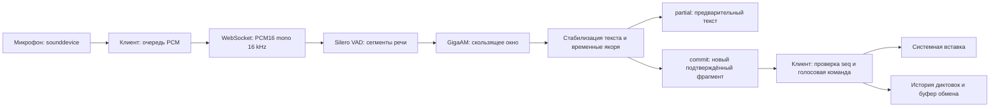

# Архитектура talk2g

Приложение состоит из клиента Python/PySide6 и сервера Python/WebSocket.
Сервер использует GigaAM v3 E2E и Silero VAD через ONNX Runtime на CPU.
Клиент постепенно вводит подтверждённый текст в активное приложение.

## Путь диктовки

Захват и передача звука выполняются вне UI-потока. Очередь клиента ограничена
600 пакетами по 100 мс. Переполнение завершает запись с явной ошибкой.
Аудио с микрофона не записывается на диск.

Сервер принимает одну активную сессию. Один `ThreadPoolExecutor` выполняет
распознавание, пока асинхронный обработчик продолжает получать звук и команды.
Silero обрабатывает кадры по 512 сэмплов; сегментация сохраняет начало речи,
неполный кадр при Stop и перекрытия на границе окна. Буфер сервера ограничен
60 секундами, продолжительность сессии — двумя часами.

## Подтверждение текста

По умолчанию окно составляет 10 секунд, интервал распознавания — 0,7 секунды,
пауза завершения сегмента — 0,6 секунды, удержание свежего хвоста — 0,8 секунды.
Настройки и допустимые диапазоны определены в `config.py`.

`Transcript` сопоставляет текущую и предыдущую гипотезы по тексту и временам слов.
Устойчивое начало подтверждается, последнее слово и свежий хвост остаются в partial.
На паузе и Stop подтверждается остаток сегмента; принудительная граница окна
сохраняет хвост для распознавания с перекрытием. Временные якоря отделяют уже
введённые слова и сохраняют повторы, произнесённые в другое время.

Каждый commit содержит только новый текст и возрастающий `seq`.
Клиент игнорирует повторный номер и останавливает сессию при пропуске фрагмента.
Итог `session_end.text` должен совпадать с конкатенацией commit.
Подтверждённый текст дополняется; уже введённые символы не переписываются.
Контракт соединения — [PROTOCOL.md](PROTOCOL.md).

## Время жизни модели и ввод

С включённой загрузкой по требованию микрофон начинает запись сразу, а клиент
накапливает PCM до готовности сервера. Stop закрывает микрофон и обрабатывает
накопленный звук; после завершения собственный сервер приложения закрывается.
С выключенной загрузкой по требованию сервер запускается вместе с интерфейсом
и держит модель в памяти. `LocalService` управляет только процессом, который
запустил сам; отдельный или удалённый сервер продолжает работать независимо.

На Windows используются RegisterHotKey и Unicode SendInput. На X11 используются
GrabKey и вставка через clipboard; смена целевого окна приостанавливает ввод.
Wayland использует системные порталы, доступность которых зависит от рабочего стола.
Подтверждённая команда «конец связи» при включённой настройке завершает диктовку
и исключается из результата вместе с последующим текстом.

## Карта исходников

| Файл в `src/talk2g` | Ответственность |
|---|---|
| `cli.py` | Команды app, server, download, transcribe, replay, doctor, toggle и quit |
| `desktop.py` | Интерфейс, трей, настройки, виджет, управление записью и системной вставкой |
| `client.py` | Захват звука, очередь PCM, WebSocket и последовательность commit |
| `server.py` | Сессия распознавания, авторизация, обработка PCM и события |
| `audio.py` | Чтение аудиофайлов, PCM, сегментация и перекрытия |
| `model.py` | Веса GigaAM/Silero, ONNX Runtime, слова с временными отметками |
| `transcript.py` | Подтверждение текста, удержание хвоста и временные якоря |
| `input.py`, `hotkey.py`, `xkb.py`, `portal.py` | Платформенная вставка и глобальный хоткей |
| `service.py` | Проверка health и управление собственным сервером |
| `voice_command.py` | Обработка команды остановки |
| `config.py`, `history.py` | Настройки и SQLite-история последних 100 диктовок |
| `autostart.py`, `runtime.py` | Автозапуск и подготовка окружения Qt |

Настройки, SQLite и логи находятся в `.data`, веса — в `models`.
Корень задаётся `TALK2G_HOME`, аргументом `app --home` или расположением
проекта/автономного приложения. Локальные данные и веса не входят в Git.
Проверки — [VALIDATION.md](VALIDATION.md); сборка — `packaging/build.py`.
