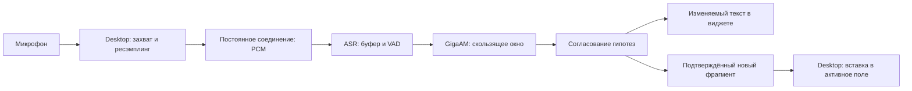

# Голосовой ввод с GigaAM: исследование и проектирование

Дата проверки источников: 2 октября 2026 года. Рабочее название проекта: Giga Dictation.

Задача: заменить используемый сценарий OpenWhispr приложением для Windows и Linux, которое распознаёт русскую речь во время диктовки и постепенно вводит подтверждённый текст в активное поле. Сервер распознавания может работать на отдельном компьютере или на машине пользователя.

Этот документ сохраняет первоначальное исследование и варианты архитектуры. Затем в этой папке реализовано самостоятельное приложение на Python/Qt и ONNX Runtime; код других диктовщиков не использован. Модели запущены, измерены реальные задержки, проверены микрофон и ввод на Linux X11. Актуальные инструкции находятся в [README.md](README.md), результаты — в [VALIDATION.md](VALIDATION.md). Рекомендации о выборе исходной основы ниже относятся к исследовательскому этапу.

## Рекомендация

Для первого прототипа использовать GigaAM v3 E2E, обработку скользящего аудиоокна и подтверждение устойчивого начала гипотезы. Клиент должен получать результаты через постоянное двустороннее соединение и вставлять только новые подтверждённые фрагменты. Незавершённый текст показывать в небольшом окне предварительного просмотра.

Сначала измерить распознавание и проверить вставку текста на обеих ОС. Для desktop-части наиболее близкая готовая основа — ArcanaGlyph: она уже работает с GigaAM, Windows и Linux. Решение о форке принять после небольшого прототипа, проверив, что её платформенные модули подходят нужным приложениям. Новый ASR-сервис отделить от desktop-клиента, чтобы использовать существующий фоновый сервер или локальный процесс.

Куски по 10–20 секунд подходят для экономного режима, но первый результат потребует накопления такого куска. Для быстрого режима нужна более частая обработка с сохранением контекста.

## Что умеет модель Сбера

Нужная модель называется **GigaAM**. Это открытая акустическая модель распознавания речи. Для русской диктовки интересны `v3_e2e_rnnt` и `v3_e2e_ctc`: E2E-версии поддерживают пунктуацию и нормализацию текста. В семействе также появилась multilingual-линейка, но её выбор требует отдельной проверки качества смешанной речи. [Официальный репозиторий GigaAM](https://github.com/salute-developers/GigaAM).

В публично документированном SDK показаны `transcribe()` и `transcribe_longform()`. Для короткого метода указано ограничение 25 секунд. Это не готовый контракт потоковой диктовки с состоянием между порциями аудио. Наличие RNN-T-декодера само по себе не подтверждает, что опубликованный encoder и runtime умеют обрабатывать только новые кадры. Для MVP предлагается повторное распознавание ограниченного окна; полноценное сохранение encoder cache — отдельное направление исследования. [Документация SDK](https://github.com/salute-developers/GigaAM#usage).

Для ONNX-прототипа есть библиотека `onnx-asr`: она поддерживает GigaAM v3 E2E CTC/RNN-T, ввод массива аудиосэмплов, квантованные модели и результаты с временными отметками. Конкретный формат отметок и точность для выбранного checkpoint нужно проверить в прототипе. [Документация onnx-asr](https://istupakov.github.io/onnx-asr/usage/).

Не следует заранее считать CTC быстрее RNN-T или наоборот. Сравнивать нужно одинаковые аудиоокна на одном сервере. Предварительная пара для сравнения: `gigaam-v3-e2e-rnnt` и `gigaam-v3-e2e-ctc` в именовании `onnx-asr`.

## Найденные приложения и серверы

| Проект | Платформы / роль | Подтверждённый сценарий | Применимость |
| --- | --- | --- | --- |
| [ArcanaGlyph](https://github.com/py-art/arcanaglyph) | Windows, Linux X11/Wayland; desktop | GigaAM, хоткей, виджет, вставка в активное окно после остановки | Самая близкая основа клиентской части; постепенную вставку с GigaAM потребуется добавить |
| [GigaType](https://github.com/kpoxo6op/gigatype) | Linux X11/Wayland, другие Unix desktop | GigaAM v3; F9: запись, затем остановка и вставка | Полезный Linux-референс, Windows не заявлен |
| [ScribeAir](https://gitflic.ru/project/borisovai/voice-input) | Windows | GigaAM, VAD, progressive transcription и live preview | Близок по предварительному распознаванию; вставка подтверждённых слов до остановки не подтверждена |
| [Lazy to Text](https://github.com/aa-blinov/lazy-to-text) | Windows, macOS | GigaAM через ONNX; остановка → распознавание → вставка | Подходит для обычной локальной диктовки; основной сценарий ожидания остаётся |
| [quasistreaming-gigam](https://github.com/v3rt3p/quasistreaming-gigam) | Сервер WebSocket, CPU/CUDA | GigaAM + TEN VAD; partial-результаты через повторный decode короткого окна | Близкий референс ASR-прототипа; desktop-вставки нет |
| [gigaam-v3-runtime](https://github.com/deeray-ltd/gigaam-v3-runtime) | Rust ASR-сервер, CPU/CUDA/TensorRT | WebSocket CTC, пересмотр хвоста, границы stable/final | Кандидат на готовый backend после замеров и проверки поставки модели; это ранняя версия |

У `quasistreaming-gigam` открытая актуальная README описывает `v3_e2e_rnnt` и оконное перераспознавание; некоторые поисковые выдержки ещё показывают прежнюю multilingual-конфигурацию. Для воспроизводимого прототипа необходимо фиксировать commit, checkpoint и версии зависимостей. [Актуальное описание](https://github.com/v3rt3p/quasistreaming-gigam).

У `gigaam-v3-runtime` WebSocket работает с CTC, а RNN-T доступен в пакетном пути. Его `stable` означает устойчивость порядка слов, но допускает изменение текста; `final` обозначает неизменяемую часть. Поэтому нельзя напрямую превращать любое событие `stable` во вставку в чужое приложение. Авторы также предупреждают, что стандартное окно 30 секунд на CPU может обрабатываться медленнее реального времени. [Контракт API](https://github.com/deeray-ltd/gigaam-v3-runtime/blob/main/docs/API.md), [README](https://github.com/deeray-ltd/gigaam-v3-runtime).

Подтверждённой готовой программы, полностью совмещающей **GigaAM + Windows/Linux + ввод подтверждённых фрагментов во время непрерывной речи**, в исследованной выборке не найдено. Это вывод о проверенных проектах, а не утверждение об отсутствии таких программ вообще. Опубликованные авторами WER и времена обработки не принимаются за прогноз для оборудования пользователя.

## Что изменилось в OpenWhispr

Начиная с версии 1.7.6 авторы описывают локальный потоковый режим на Nemotron через sherpa-onnx. Предварительный текст обновляется во время речи; после остановки приложение завершает поток и использует полученную транскрипцию без обычного второго полного распознавания. В multilingual-варианте заявлен русский язык. Это полезный способ проверить, достаточно ли обновления текущего приложения для сокращения ожидания. Описанное поведение относится к предварительному просмотру и завершению диктовки; постепенная вставка в активное приложение во время речи здесь не подтверждается. [Техническая статья OpenWhispr](https://openwhispr.com/blog/local-streaming-speech-to-text).

Путь Self-Hosted в OpenWhispr отдельно документирован как пакетный HTTP: клиент отправляет запись на `/audio/transcriptions` и ожидает `{"text":"..."}`. Простая смена URL на сервер GigaAM не подключит потоковый протокол. [Официальный пример адаптера](https://github.com/OpenWhispr/openwhispr/tree/main/examples/custom-asr-shim).

## Наблюдение о локальном speech-to-text

В `/home/vm/pet_project/speech-to-text` уже есть gRPC-сервис и backend GigaAM. Не установлено, что именно этот сервис обслуживает текущий OpenWhispr пользователя.

В `src/server/service.py:69` метод `TranscribeStream` складывает входящие сообщения в `audio_chunks`, после завершения входного потока объединяет их и только затем вызывает `_save_and_enqueue()`. Результат клиент получает через `GetTranscription`. Таким образом, этот метод обеспечивает потоковую загрузку файла, а распознавание запускает после завершения загрузки.

Дополнительно в проверенном `compose.yml` Whisper явно настроен на CPU с лимитом по умолчанию 2 CPU. Это потенциальный фактор скорости, если развёртывание использует эту конфигурацию; фактические настройки работающего сервера не проверялись.

Для новой диктовки нужен отдельный прямой путь к постоянно загруженной модели. Существующий пакетный gRPC → Redis → worker остаётся пригоден для обработки файлов. Возможные варианты интеграции:

- отдельный сервис потоковой диктовки с WebSocket, расположенный рядом с текущим сервисом;
- отдельный двунаправленный gRPC API потоковой диктовки в самостоятельном компоненте.

Рекомендуемый MVP — отдельный WebSocket-сервис. Изменение существующего репозитория должно соблюдать его `AGENTS.md`: текущий файл и очередь не следует незаметно превращать в новый HTTP-сервис.

## Архитектура предлагаемого проекта



**Desktop-клиент:** Rust/Tauri при использовании ArcanaGlyph как основы; захват микрофона, горячая клавиша, компактный виджет, управление сессией, платформенная вставка текста. Тяжёлое распознавание не выполняется в UI-потоке. Виджет предварительного просмотра не забирает фокус у поля ввода.

**ASR-сервис MVP:** Python + `onnx-asr` + ONNX Runtime + WebSocket, модель загружена один раз при старте и прогрета. Аудио для коротких окон передаётся как массив сэмплов без промежуточных файлов и без отдельного процесса ffmpeg на каждое обновление. Альтернативный адаптер позволяет использовать готовый `gigaam-v3-runtime`, если его CTC-путь окажется подходящим по качеству и задержке.

В реализованном приложении добавлен выбор времени жизни модели. С галочкой
«Загружать модель только при диктовке» GUI открывает микрофон и запускает свой
ASR-процесс по горячей клавише. До готовности сервера PCM накапливается в очереди
на 60 секунд, затем передаётся без задержек воспроизведения. Stop закрывает микрофон
сразу, но сохраняет обработку очереди и финального хвоста. После завершения ASR-процесс
закрывается, что освобождает память ONNX Runtime независимо от поведения его allocator.
Без галочки сохраняется описанный выше постоянный прогретый сервер. Время подготовки
и размер начального аудиобуфера видны в GUI и журнале; измерения — в VALIDATION.md.

**Размещение:** один и тот же протокол для фонового сервера пользователя и локального ASR-процесса. На одной машине соединение через loopback. Для удалённого сервера — защищённое соединение и аутентификация. Базовая первая версия рассчитана на одну активную диктовку на сервер.

**Модель:** сравнить две GigaAM v3 E2E версии; взять победителя по задержке вставки при приемлемом качестве. CPU INT8 и GPU FP16 — варианты для измерения, а не обязательные условия или гарантии ускорения. Rust вместо Python сам по себе не ускорит математические операции той же ONNX-модели.

Предлагаемая структура после начала реализации:

```text
giga-dictation/
  desktop/             # хоткей, микрофон, виджет, платформенная вставка
  asr-service/         # модель, VAD, окна, согласование и соединение
  protocol/            # описание событий и контракт сессии
  benchmarks/          # воспроизведение аудио в реальном темпе
  docs/                # установка, совместимость и измерения
```

## Алгоритм обработки аудио

Предлагаемые начальные параметры должны настраиваться и уточняться по замерам.

| Параметр | Начальное значение | Назначение |
| --- | --- | --- |
| Передаваемый звук | PCM S16LE, mono, 16 kHz | Предсказуемый вход без задержки кодирования |
| Пакет передачи | 50–100 мс | Передача во время записи |
| Первый decode | После 1–1,5 с речи | Получить начальную гипотезу |
| Последующие decode | Каждые 0,5–1 с, если хватает скорости | Обновлять результат до остановки |
| Рабочее аудиоокно | До 8–12 с | Ограничить повторные вычисления |
| Контекст после сдвига | Около 1–1,5 с | Сохранить слова на границе |
| Подтверждение префикса | Совпадение 2–3 последовательных гипотез | Снизить частоту преждевременных вставок |
| Неизменяемый ввод | Исключить последние 1–1,5 с / минимум 1–2 слова | Оставить модели пересматриваемый хвост |
| Конец фразы по VAD | Тишина около 450–700 мс | Завершить оставшийся хвост |
| Максимум окна официального short-form SDK | 24 с | Оставить запас до документированных 25 с |

VAD отмечает речь и паузы, но не является условием единственного запуска распознавания. Во время длинного высказывания без пауз периодические decode продолжаются. Перед началом речи сохраняется небольшой pre-roll, чтобы не обрезать первый звук. В момент остановки сохраняются все уже захваченные сэмплы, включая последний неполный пакет.

Обработка одной сессии:

1. Непрерывно принимать звук, сохранять абсолютные позиции сэмплов и состояние ресэмплера/VAD.
2. Запускать decode текущего окна по таймеру. Каждая следующая гипотеза должна учитывать новую порцию аудио.
3. Сопоставлять слова и временные отметки с предыдущими гипотезами, отделять уже выданный префикс.
4. Общую устойчивую часть за пределами защищённого хвоста выдавать как новый `commit`. Результат сравнения — эвристика: совпадение не доказывает безошибочность распознавания.
5. Остаток гипотезы отправлять как заменяемый `partial`, отображаемый только в виджете.
6. Сдвигать окно по временной границе подтверждённых слов, сохраняя левый контекст. При отсутствии устойчивых слов ограничивать окно через контролируемое завершение сегмента и перекрытие.
7. На паузе или явной остановке завершать текущий сегмент и выдавать только невставленный остаток. Если уже выполненный decode покрывает весь сегмент, использовать его; иначе распознавать оставшееся окно. Вся длинная запись заново не обрабатывается.

Подход с согласованием нескольких гипотез известен как LocalAgreement. Он описан, например, в Whisper-Streaming. Здесь предлагается использовать принцип для GigaAM; перенос и его качество требуют проверки. Старый Whisper-Streaming авторы уже считают заменяемым SimulStreaming, поэтому его рассматриваем как описание алгоритма. [Источник LocalAgreement](https://github.com/ufal/whisper_streaming).

Нельзя склеивать перекрытия только удалением совпадающей строки: законное «да, да» может потерять слово. Нужны временное выравнивание и учёт границ сегментов. Пунктуация, числа, аббревиатуры и замены вроде «питон → Python» должны завершаться до `commit` соответствующего фрагмента. Для неполного числа или слова требуется более осторожная задержка. Автоматическая правка уже введённого текста в первой версии не предусматривается.

## Подтверждённый текст и предварительный просмотр

У клиента два независимых состояния:

- `committed_text`: фрагменты, уже отправленные на ввод; обычное обновление гипотезы их не заменяет;
- `partial_text`: текущий изменяемый хвост; следующее событие заменяет его целиком.

Например, в поле уже введено «Завтра я отправлю», а виджет показывает «документы бухгалтеру». Новая гипотеза может изменить только показанный хвост. После подтверждения «документы» клиент вводит это слово один раз и оставляет «бухгалтеру» в предварительном просмотре.

Эта политика позволяет вводить текст во время непрерывной речи без автоматического Backspace по чужому редактору. Ошибочно подтверждённое слово исправляется пользователем. Сценарий, где требуется более осторожный ввод, переключается на подтверждение целых фраз после паузы.

Полная LLM/T5-редактура не входит в путь быстрого ввода. Если она потребуется, её можно выполнять для отдельного результата в истории или для фразы до вставки с явно выбранным режимом дополнительной задержки.

## Контракт сессии

Это предлагаемый собственный протокол, а не действующий API Сбера.

Клиент открывает соединение и отправляет `start` с версией протокола, `session_id`, форматом аудио, именем модели и выбранным режимом подтверждения. После `ready` передаёт бинарные пакеты с `seq`, абсолютной позицией начала аудио и PCM. Начальные сэмплы захвата хранятся до `ready`, чтобы загрузка соединения не обрезала начало.

| Событие сервера | Смысл | Действие клиента |
| --- | --- | --- |
| `ready` | Модель и сессия готовы | Начать/продолжить передачу буферизованного звука |
| `partial` | Новая версия неподтверждённого хвоста | Заменить текст в виджете |
| `commit` | Новый неизменяемый фрагмент с порядковым номером | Вставить дельту; сохранить номер обработанного события |
| `segment_end` | Фраза завершена, выдача её хвоста закончена | Сбросить отображение хвоста этой фразы |
| `session_end` | Все принятые сэмплы обработаны | Завершить диктовку |
| `error` / `overload` | Сессия не может продолжаться в выбранном режиме | Показать состояние и сохранить невведённый результат |

Все события содержат `session_id`, `segment_id` при необходимости и монотонный номер. `commit` содержит готовую к вводу дельту с пробелами/пунктуацией и временную границу. Финальный итог сессии используется для истории; он не вставляется повторно после последовательности дельт.

`stop` отправляется после последнего аудиопакета и включает его номер. Закрывать соединение до `session_end` нельзя: иначе можно потерять конец речи. `cancel` прекращает будущую вставку; ранее введённый текст сохраняется. Отдельная команда удаления уже вставленного текста потребует собственного механизма владения диапазоном.

Дедупликация событий предотвращает повторную вставку при повторной доставке. Она не обеспечивает атомарную «ровно один раз» вставку в произвольное стороннее приложение при падении клиента. Если неизвестно, прошла ли последняя вставка, клиент показывает невведённый/сомнительный остаток для ручного восстановления, а не повторяет всё автоматически.

## Windows, X11 и Wayland

| Среда | Предлагаемая вставка | Практическое ограничение |
| --- | --- | --- |
| Windows | `SendInput` с Unicode; для несовместимых полей — пакетная вставка через clipboard | UIPI ограничивает ввод в приложения с более высоким уровнем прав; нужно проверить кириллицу и модификаторы хоткея |
| Linux X11 | Clipboard и эмуляция подходящей команды вставки через XTest/платформенный модуль | У терминалов и некоторых редакторов другая комбинация; буфер должен оставаться доступным до чтения получателем |
| Linux Wayland | XDG RemoteDesktop portal для клавиатурного ввода, clipboard; GlobalShortcuts portal либо shortcut окружения | Наличие возможностей зависит от compositor и portal backend; доступ запрашивается штатным системным диалогом |

Источники: [SendInput](https://learn.microsoft.com/en-us/windows/win32/api/winuser/nf-winuser-sendinput), [Unicode INPUT](https://learn.microsoft.com/en-us/windows/win32/api/winuser/ns-winuser-input), [RemoteDesktop portal](https://flatpak.github.io/xdg-desktop-portal/docs/doc-org.freedesktop.portal.RemoteDesktop.html), [GlobalShortcuts portal](https://flatpak.github.io/xdg-desktop-portal/docs/doc-org.freedesktop.portal.GlobalShortcuts.html).

В Wayland нельзя обещать одинаковое поведение во всех GNOME/KDE/wlroots-сессиях. При недоступной автоматической вставке остаются предварительный просмотр и копирование подтверждённого текста. Для первой версии лучше явно проверять конкретное окружение пользователя, а не выбирать низкоуровневую эмуляцию через `/dev/uinput` по умолчанию.

Клиент вставляет фрагмент, только когда может подтвердить подходящую цель ввода. При доступном отслеживании смены окна/фокуса вставка приостанавливается. Если окружение не позволяет надёжно установить цель, используется явный режим направления текста в текущее поле или ручное подтверждение. Проверка окна не гарантирует неизменность курсора внутри этого же окна.

Вставки сериализуются. Буфер обмена восстанавливается лишь после чтения получателем или проверенного для приложения завершения вставки, и только если пользователь тем временем не скопировал другой текст. Универсальное мгновенное восстановление ненадёжно. Для частого ввода предпочтителен прямой Unicode-путь там, где он работает корректно.

## Производительность и целевые задержки

Низкий RTF пакетного распознавания ещё не означает, что повторные оконные decode поспевают за речью.

Обозначения: `W` — длина окна, `D(W)` — время одного decode, `Δ` — интервал обновления. Для одного последовательного вычислителя должно выполняться `D(W) < Δ` с запасом на остальную обработку. Приблизительная вычислительная нагрузка равна `D(W) / Δ`.

Например, окно 8 секунд при RTF 0,15 распознаётся за 1,2 секунды. Это быстрее длительности записи, но обновление каждые 0,5 секунды создаёт нагрузку 2,4 и постоянно растущую очередь. Для такого сервера нужно увеличить интервал, сократить окно, ускорить модель или переключить режим подтверждения.

Плановые критерии быстрого режима после прогрева:

| Метрика | Цель первого прототипа |
| --- | --- |
| Появление первой гипотезы от начала речи | Около 1–2 с |
| Ввод устойчивого слова от конца этого слова | Обычно около 1,5–3 с |
| Обработка хвоста после паузы/Stop | Около 0,5–1,5 с при достаточной скорости сервера |
| Непрерывная диктовка 5–10 минут | Задержка и память не растут с длительностью сессии |

Это цели проектирования. В приёмке нужно записывать p50/p95 и реальные максимумы; абсолютные значения зависят от железа, модели, сети и стратегии подтверждения.

Для одной сессии допускается один активный decode и один ожидающий актуальный partial-запрос. Устаревшие планы предварительного decode можно объединять; аудиосэмплы и задания завершения сегментов терять нельзя. При отставании снижается частота partial-обновлений, завершающие задания получают приоритет, пользователю показывается накопившаяся задержка. Буферы ограничены; при исчерпании лимита система прекращает приём с явным состоянием, сохранив уже принятый остаток.

Оптимизации в порядке проверки: постоянно загруженная и прогретая модель, отсутствие полного второго прохода после Stop, массив аудио вместо файлов, ограниченное окно, настройка потоков CPU, INT8/FP16, затем CUDA/TensorRT. Работа с реальным encoder cache имеет смысл только после проверки поддержки конкретной модели и runtime.

## План реализации и проверки

1. **ASR-прототип.** Воспроизводить один и тот же набор русской речи в реальном темпе, передавать по 50–100 мс. Сравнить обе E2E-модели и доступные режимы CPU/GPU. Измерить `D(W)` для окон 2/4/8/12 секунд. Выбрать модель, окно и cadence по фактической задержке подтверждённого слова.
2. **Окна и подтверждение.** Добавить VAD, partial/commit, временное выравнивание, защищённый хвост и flush. Проверить длинную речь без пауз, повторяющиеся слова, числа, имена, термины, короткие паузы и последние слова перед Stop.
3. **Минимальный desktop.** Один хоткей, выбор микрофона, виджет без захвата фокуса, соединение с сервером, вставка дельт. Начать с Windows и конкретного Linux пользователя. Использовать платформенные части ArcanaGlyph, если проверка подтвердит их пригодность.
4. **Надёжность.** Проверить смену поля ввода, ручное редактирование, удерживаемые модификаторы, повтор события, отключение микрофона, сетевой разрыв, перегрузку и падение ASR. При неопределённой вставке должен оставаться доступный текст для восстановления.
5. **Поставка.** Установщик Windows и пакет Linux, автозапуск ASR, загрузка/кеш модели, диагностика готовности, настройки паузы и режима подтверждения. Модель и зависимости фиксируются по версиям/хешам.

Первичный набор приёмки: 15–30 минут собственной диктовки пользователя с эталонным текстом и несколькими реальными приложениями. Помимо WER считать пропуски/дубли на границах, ошибочные ранние подтверждения, задержку вставки p50/p95, хвост после Stop, загрузку CPU/GPU и рост очереди. Пунктуацию и нормализацию чисел оценивать отдельно от WER слов.

Главный критерий: при длинной диктовке подтверждённый текст появляется в поле до Stop, первые и последние слова сохраняются, а время завершения зависит от оставшегося хвоста, а не от длительности всей записи.

## Облачный вариант Сбера

Если обработка на своём сервере не обязательна, у Сбера есть SaluteSpeech с документированным потоковым gRPC v2, промежуточными гипотезами и определением конца фразы. Это отдельный облачный сервис; его API не подтверждает использование конкретного открытого checkpoint GigaAM. Старый gRPC v1 уже помечен как неподдерживаемый. [Действующий gRPC v2](https://developers.sber.ru/docs/ru/salutespeech/api/grpc/recognition-stream-2), [статус старого API](https://developers.sber.ru/docs/ru/salutespeech/api/grpc/recognition-stream).

Облачный адаптер может использовать тот же клиентский контракт partial/commit, но итоговая задержка требует измерения сети и правил финализации сервиса. Для задачи с уже имеющимся фоновым сервером основной предложенный путь — собственный GigaAM-сервис.
